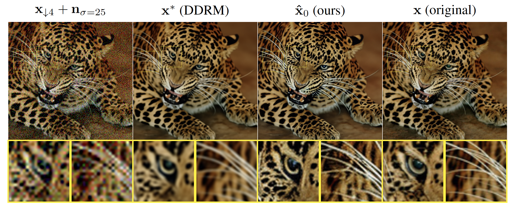

# DOT-Dmax

Official Pytorch implementation of _Deep Optimal Transport: A Practical Algorithm for Photo-realistic Image Restoration_

> We propose an image restoration algorithm that can control the perceptual quality and/or the mean square error (MSE) of any pre-trained model, trading one over the other at test time. Our algorithm is few-shot: Given about a dozen images restored by the model, it can significantly improve the perceptual quality and/or the MSE of the model for newly restored images without further training.



## Dependencies
We used [miniconda3](https://docs.conda.io/en/latest/miniconda.html) and [pip3](https://pip.pypa.io/en/stable/) to manage dependencies
```bash
conda create -n dmax python=3.8
conda activate dmax
pip install -e .
```

## Usage
Example of our algorithm applied to the [SwinIR](https://github.com/JingyunLiang/SwinIR) model for SISRx4.

NB: This is a simplified example. For the full algorithm implementation, see `dmax/main.py` and [Reproducing results](#Reproducing-results).
```python
from PIL import Image

import torch
from torchvision.transforms.functional import to_tensor, resize
from torchvision.utils import save_image
from datasets import load_dataset

from dmax.latent_w2 import LatentW2
from dmax.models import swinir

device = "cuda" if torch.cuda.is_available() else "cpu"
dmax = LatentW2("stabilityai/sd-vae-ft-ema").to(device)
model = swinir("classical_sr-4", pretrained=True).to(device)
dataset = iter(load_dataset("imagenet-1k", split="train", streaming=True))

for _ in range(100): # arbitrary resolution & aspect ratios
    x = to_tensor(next(dataset)['image']).to(device).unsqueeze(0)
    dmax.update(x, distribution="target")  # update nat. image statistics

for _ in range(100):  # unpaired updates
    x = to_tensor(next(dataset)['image']).to(device).unsqueeze(0)
    y = resize(x, (x.size(-2)//4, x.size(-1)//4), antialias=True)  # degrade image
    x_star = model(y)  # restore with the pre-trained model
    dmax.update(x_star, distribution="source")  # update model statistics

w2 = dmax.compute()  # compute the latent transport operator & W2 distance
print(f"Latent w2 distance: {w2.cpu().item():.2f}")

x = to_tensor(Image.open("../assets/baboon.png")).to(device).unsqueeze(0) 
y = resize(x, (x.size(-2)//4, x.size(-1)//4), antialias=True)
x_star = model(y) 
xhat_0 = dmax.transport(x_star) # enhance new images

collage = torch.cat([resize(y, x.shape[-2:]), x_star, xhat_0, x], dim=-1).to(device)
save_image(collage, "demo.png", nrow=1, padding=0)
```
## Paper Results
### PyDrive-API
Our algorithm enhances existing methods (we tested [SwinIR](https://github.com/JingyunLiang/SwinIR), [Swin2SR](https://github.com/mv-lab/swin2sr), [Restormer](https://github.com/swz30/Restormer), [ESRGAN](https://github.com/xinntao/ESRGAN) and [DDRM](https://github.com/bahjat-kawar/ddrm)).
Instead of imposing on users to download manually third party code, data or weights, we automate everything using google drive's API.

Note: The following only applies to *your* script, and does not give access to other users.
Nevertheless, we recommend revoking the script's access after the download is complete.

- Follow the steps of [google's pydrive quickstart](https://developers.google.com/drive/api/v3/quickstart/python) and place your `credentials.json` under the `dot-dmax` repository.
- Run `python data/gdrive.py init` (must be on a local machine, connected to a display). If the warning _"Google hasn’t verified this app"_ occurs, click `advance` and then `Go to <Your App Name> (unsafe)`.
- \[Optional\]: To be able to access the API from a remote machine, simply upload the `token.pickle` file generated by the previous step.

### Hardware Setup
We abstract hardware dependency using hugging-face's [accelerate](https://huggingface.co/docs/accelerate/index) library.
Configure your environment before launching the scripts by running
```bash
accelerate config
```
Because evaluation is quite heavy (we computed for many values of $\alpha$ on 50K samples), we distributed across 8 A6000 GPUs with `batch_size=10`.
Reduce this value if you encounter any CUDA out-of-memory issues using
```bash
export batch_size=8  # replace with your batch size
```
After configuring your hardware, launch distributed jobs by replacing `python main.py <args>`  by `accelerate launch main.py <args>`

### Datasets
If you enabled the [PyDrive-API](#PyDrive-API), you are not required to download any dataset manually, except for [ImageNet](https://www.image-net.org/).
Once downloaded, you can declare its location with the following environment variable:
```bash
export imagenet_path=~/data/ImageNet  # replace with your path
```

### Reproducing results
\[Optional\]: see [Hardware Setup](#Hardware-Setup) for distributed commands
```bash
cd dmax                # we must run main.py under the source directory
python main.py --help  # displays all optional arguments
```
```bash
# export imagenet_path=~/data/ImageNet
# export batch_size=10
# export num_workers=10
# NB: Replace `python` with `accelerate launch` for distributed run

python main.py ESRGAN classical_sr-4                                 # ESRGAN    (SISRx4)
python main.py SwinIR classical_sr-4                                 # SwinIR    (SISRx4)
python main.py SwinIR jpeg_car-10                   # SwinIR    (JPEGq10)
python main.py Restormer gaussian_color_denoising_sigma50            # Restormer (AWGNs50)
python precomputed_results.py DDRM classical_sr_4_dn_25 imagenet-1k  # DDRM      (SISRx4 + AWGNs25)

# Swin2SR   (SISRx4 + JPEGq10)
python main.py Swin2SR compressed_sr-4 \
 --natural_image_set ["compressed_sr_swin2sr"] \
 --degraded_set ["compressed_sr_swin2sr"] \
 --quantitative_set ["compressed_sr_swin2sr"] \
 --qualitative_set ["compressed_sr_swin2sr"]

# NLM has a significant memory footprint so we use a batch-size of 1
export batch_size=1
export num_workers=0
python main.py NLM color_dn-50                                       # NLM       (AWGNs50)
```
